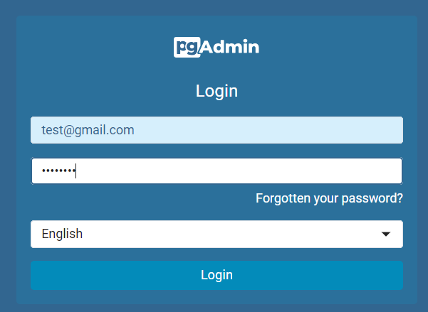
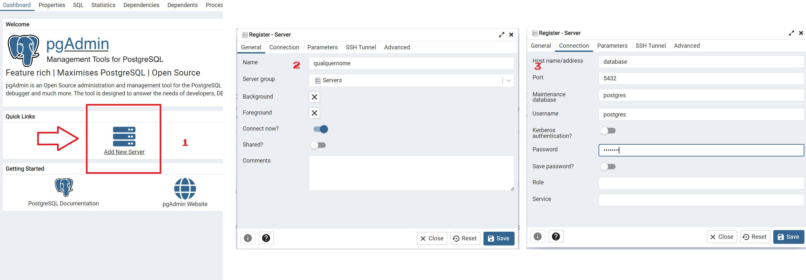
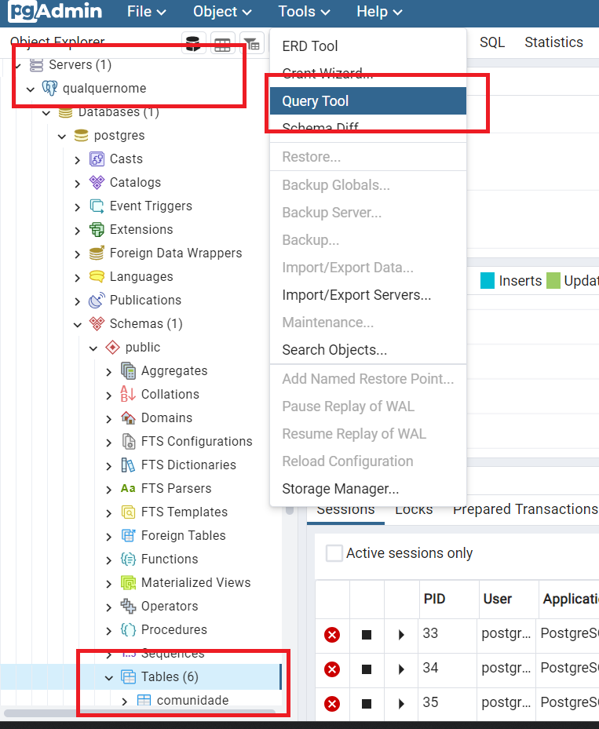
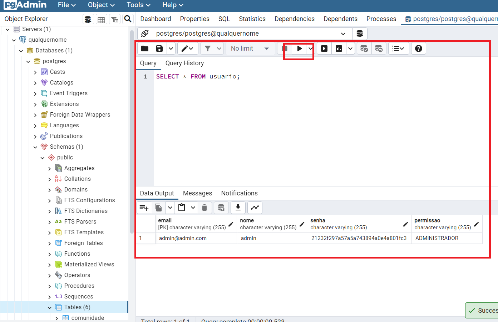

## Especificações do projeto
- Spring 2.7x
- Java 11
- Maven 3.8.4
- PostgreSQL

## Como rodar
- Essa aplicação possui um arquivo *docker-compose.yaml* na raíz do repositório, contendo os containers: da aplicação, do banco já populado com alguns dados iniciais (init.sql) e do PgAdmin para visualização de dados do banco.
- Estando **dentro da pasta raíz** do repositório e com o Docker ligado, digite o comando num terminal como o Git Bash:
```
docker-compose build --no-cache && docker compose up -d
```

## Como acessar o backend
- O backend do container está na porta 8080, então basta fazer http://localhost:8080. O caminho do swagger é http://localhost:8080/v2/swagger-ui.html

## Como acessar o client do banco
- O PgAdmin é um client do banco PostgreSQL. Ele possui credenciais para entrar e estão no docker compose. Mas estão abaixo também. Acesse http://localhost:16543 e faça login com as credenciais abaixo
  - email: test@gmail.com
  - senha: postgres
- Assim que entrar, conecte no banco da seguinte forma e vc poderá executar queries SQL:
  - 1: Acesse http://localhost:16543. A página pode demorar um pouco pra carregar. Adicione o email e senha especificados
    
  - 2: Inclua o container do banco do client como a seguir e clique em Save
    
  - 3: Você verá no menu lateral direito que o PgAdmin se conectou ao banco. Vá em Tools>Query Tool para adicionar uma query
    
  - 4: Faça a query desejada e clique no botão de Play
    


## Observações
- O docker-compose faz referência a um arquivo **.env**, que só existe localmente e **não** está na raíz do projeto. Apenas os devs têm esse arquivo, contendo os seguintes dados:
```
AWS_ACCESS_KEY_ID=access_key_aws
AWS_SECRET_ACCESS_KEY=secret_key_aws
S3_BUCKET=nome_do_bucket_pra_salvar_foto
```
- O application.yaml utilizado no projeto tem duas URL do banco: uma localhost e outra referente ao nome do container. Uma mudança futura será criar múltiplos application.yaml
- Caso hajam mudanças no backend, basta rodar o comando do docker compose descrito acima para as mudanças serem aplicadas e os novos containers rodarem